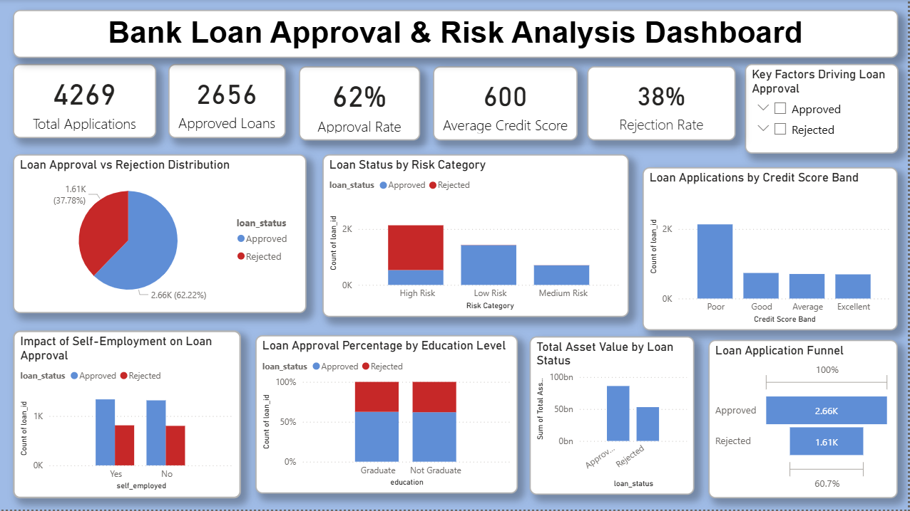

Images/Bank_Loan_Approval_dashboard.png
# 🏦 Bank Loan Approval & Risk Analysis Dashboard

## 📌 Project Overview
This project analyzes bank loan applications to understand approval patterns, risk factors, and customer segmentation using **Power BI, Excel, and SQL**
---
## 🎯 Objectives
- Analyze loan approval vs rejection trends
- Identify high-risk vs low-risk customers
- Understand impact of income, education, and employment
- Build an interactive business dashboard
---
## 🛠 Tools Used
- Power BI (Dashboard & Visualization)
- Excel (Data Cleaning)
- SQL (Data Analysis)
---
## 📊 Key KPIs
- Total Loan Applications: 4269
- Total Approved Loans: 2656
- Approval Rate: 62%
- Average Credit Score: 600
- Rejection Rate: 38%
---
## 📈 Dashboard Features
### ✔ Loan Approval Insights
- Approval vs Rejection Distribution
- Loan Conversion Funnel
### ✔ Risk Analysis
- Loan Status by Risk Category
- Credit Score Band Analysis
### ✔ Customer Insights
- Self-Employment Impact
- Education-wise Loan Approval
### ✔ Financial Analysis
- Total Asset Value by Loan Status
---
## 🔍 Key Insights
- 62% approval rate indicates moderate lending strategy
- High-risk customers have higher rejection rates
- Income and assets strongly influence loan approval
- Majority customers fall under low and medium risk
---
## 📸 Dashboard Preview

---
